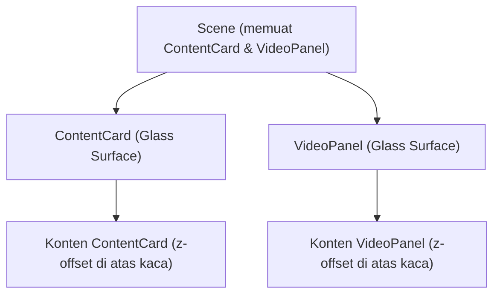

## 1. Product Overview
Standarisasi tampilan glassmorphism untuk komponen **ContentCard** dan **VideoPanel** agar konsisten dengan setting Figma.
Mencakup fill/stroke, material blur (MeshTransmissionMaterial), dan aturan z-offset untuk konten.

## 2. Core Features

### 2.1 User Roles
Tidak perlu pemisahan role; ini perubahan visual/komponen.

### 2.2 Feature Module
1. **Scene/halaman yang memuat ContentCard & VideoPanel**: preset glassmorphism (fill, stroke, transmission blur), layering z-offset konten.

### 2.3 Page Details
| Page Name | Module Name | Feature description |
|-----------|-------------|---------------------|
| Scene yang memuat ContentCard & VideoPanel | Preset Glassmorphism | Menerapkan fill putih opacity 0.36 dan stroke putih solid dengan emissive 0.5 pada surface kaca. |
| Scene yang memuat ContentCard & VideoPanel | Material Blur (3D) | Menggunakan MeshTransmissionMaterial dengan transmission 0.64, roughness 0.2, thickness 0.1 untuk efek kaca/blur. |
| Scene yang memuat ContentCard & VideoPanel | Z-offset Konten | Menggeser konten (teks/ikon/video) di sumbu-Z agar berada di atas surface kaca, mencegah z-fighting dan meningkatkan depth. |

## 3. Core Process
Alur utama:
- Kamu menetapkan preset glassmorphism (nilai fill/stroke/material) sebagai standar.
- Komponen **ContentCard** dan **VideoPanel** mengadopsi preset yang sama untuk surface kaca.
- Konten di dalam card/panel diberi z-offset konsisten agar terbaca jelas dan tidak “nempel” di permukaan kaca.

