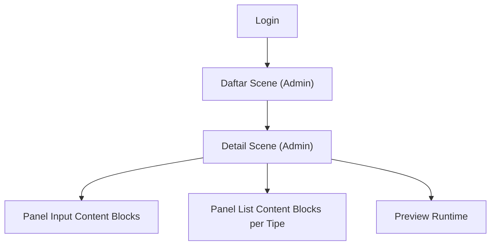

## 1. Product Overview
Perombakan halaman **Detail Scene (Admin)** untuk mempercepat pembuatan dan pengelolaan konten scene.
Fokus utama: **dynamic add content blocks**, **panel input terpisah dari panel list per tipe**, dan **konsistensi data dengan backend**.

## 2. Core Features

### 2.1 User Roles
| Role | Registration Method | Core Permissions |
|------|---------------------|------------------|
| Admin | Login (akun dibuat oleh tim) | Kelola scene: objects, content blocks, interactions, practice steps, evaluation; publish status |
| Student | Login (akun dibuat oleh tim) | Mengakses runtime/scene (bukan halaman admin) |

### 2.2 Feature Module
Kebutuhan terdiri dari halaman inti berikut:
1. **Login**: input kredensial, simpan token sesi.
2. **Daftar Scene (Admin)**: daftar scene per modul, akses cepat ke detail scene.
3. **Detail Scene (Admin)**: status scene, pengelolaan objects, content blocks (UI baru), interactions, practice steps, evaluation, tautan preview runtime.

### 2.3 Page Details
| Page Name | Module Name | Feature description |
|-----------|-------------|---------------------|
| Login | Form login | Memasukkan email & password; menyimpan access token; menampilkan error autentikasi. |
| Daftar Scene (Admin) | Daftar & navigasi | Menampilkan list scene; membuka halaman detail scene dari item list. |
| Detail Scene (Admin) | Ringkasan scene | Menampilkan judul/slug/tipe/order; mengubah dan menyimpan status (draft/published/archived); melakukan refresh data dari backend. |
| Detail Scene (Admin) | Objects | Menambah object; mengubah object; menghapus object; menampilkan list object di scene. |
| Detail Scene (Admin) | Content Blocks - Struktur panel | Memisahkan **Panel Input** (create/edit) dari **Panel List**; mempertahankan panel list tetap terlihat saat input (sticky/2-kolom). |
| Detail Scene (Admin) | Content Blocks - List per tipe | Menampilkan content blocks yang **dikelompokkan per blockType** (card/instruction/hotspot/label); menampilkan ringkasan tiap item (title, orderNo, target, active). |
| Detail Scene (Admin) | Content Blocks - Dynamic add | Menambah block lewat tombol **Tambah** pada tipe tertentu (preselect blockType); form berubah sesuai tipe yang dipilih; reset form setelah sukses agar dapat menambah block berikutnya dengan cepat. |
| Detail Scene (Admin) | Content Blocks - Edit/Toggle/Delete | Memilih item dari list untuk mode edit; menyimpan perubahan; enable/disable (isActive); menghapus item; membatalkan mode edit tanpa mengubah data di backend. |
| Detail Scene (Admin) | Interactions | Menambah interaction (select → open content); enable/disable; menghapus; memastikan targetRef mengarah ke content block yang ada. |
| Detail Scene (Admin) | Practice Steps | Menambah step; menghapus step; menampilkan list step terurut (stepNo). |
| Detail Scene (Admin) | Evaluation | Menambah evaluation (1 item per scene); validasi JSON config; menghapus evaluation. |
| Detail Scene (Admin) | Konsistensi data dengan backend | Menjadikan backend sebagai source-of-truth: setelah create/update/delete, UI memperbarui list berdasarkan respons backend dan melakukan re-fetch untuk revalidasi; menampilkan error dari backend apa adanya; mencegah state “campur” saat ganti sceneId (reset state & reload). |

## 3. Core Process
**Admin Flow**
1) Admin login.
2) Admin membuka Daftar Scene.
3) Admin memilih satu scene → masuk Detail Scene.
4) Admin mengelola content blocks dengan pola baru: pilih tipe → isi form di Panel Input → simpan → item muncul/terbarui di Panel List per tipe.
5) Admin dapat melakukan refresh untuk memastikan data identik dengan backend.

