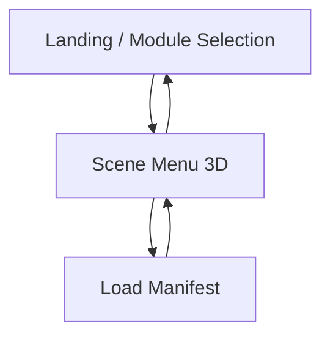

## 1. Product Overview
Perombakan landing page untuk apps/mr agar pengguna bisa memilih modul (Sepeda Motor / Mobil Listrik), lalu melanjutkan ke menu scene 3D dan memulai pemuatan scene dari manifest.
Fokus utama: alur navigasi yang jelas + kontrol input XR (XRController/hand) yang konsisten.

## 2. Core Features

### 2.1 Feature Module
Kebutuhan aplikasi terdiri dari halaman utama berikut:
1. **Landing / Module Selection**: selection cards Sepeda Motor/Mobil Listrik, CTA lanjut, indikator status XR input.
2. **Scene Menu 3D**: tampilkan menu scene di lingkungan 3D, pilih scene, mulai load manifest, tampilkan status loading.

### 2.3 Page Details
| Page Name | Module Name | Feature description |
|-----------|-------------|---------------------|
| Landing / Module Selection | Selection Cards | Menampilkan 2 kartu pilihan: “Sepeda Motor” dan “Mobil Listrik”. • Menandai pilihan aktif. • Menyimpan pilihan modul untuk langkah berikutnya. |
| Landing / Module Selection | Primary CTA | Mengarahkan ke Scene Menu 3D berdasarkan modul terpilih. |
| Landing / Module Selection | XR Input Status | Menampilkan status ketersediaan input: XRController dan/atau hand tracking (jika didukung). |
| Scene Menu 3D | 3D Scene Menu | Menampilkan menu scene dalam 3D yang relevan dengan modul terpilih. • Memungkinkan highlight/seleksi scene menggunakan XRController/hand. |
| Scene Menu 3D | Load Manifest | Memuat file manifest untuk scene yang dipilih. • Validasi sederhana (manifest ditemukan/format dapat dibaca). |
| Scene Menu 3D | Loading & Error State | Menampilkan progress/indikator loading saat manifest/asset dimuat. • Menampilkan pesan error dan aksi coba lagi bila load gagal. |
| Scene Menu 3D | Navigation Back | Kembali ke Landing untuk ganti modul. |

## 3. Core Process
**Alur Pengguna (umum):**
1) Kamu membuka landing page dan melihat dua kartu pilihan modul.
2) Kamu memilih “Sepeda Motor” atau “Mobil Listrik”, lalu menekan tombol lanjut.
3) Kamu masuk ke menu scene 3D; kamu memilih salah satu scene menggunakan XRController/hand (atau pointer non-XR bila tersedia).
4) Aplikasi memuat manifest untuk scene terpilih dan menampilkan status loading.
5) Jika loading gagal, kamu melihat error dan bisa mencoba lagi atau kembali.

