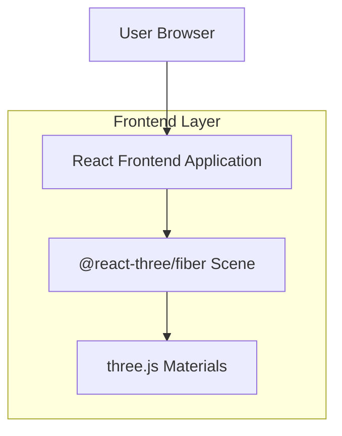

## 1.Architecture design

## 2.Technology Description
- Frontend: React@18 + @react-three/fiber + three + @react-three/drei
- Backend: None

## 3.Route definitions
| Route | Purpose |
|-------|---------|
| / | Memuat scene yang menampilkan ContentCard & VideoPanel dengan preset glassmorphism |

## 4.API definitions (If it includes backend services)
Tidak ada backend.

## 6.Data model(if applicable)
Tidak ada.

---

### Implementasi Material (Spesifikasi Teknis)
**Target komponen:** `ContentCard` dan `VideoPanel`.

#### A. Surface kaca (Glass Surface)
- **Fill (Figma):** Putih dengan opacity **0.36**.
  - Implementasi yang disarankan di material: `color = #FFFFFF` dan `opacity = 0.36` (jika memakai blending/transparency), atau gunakan `materialColor` putih dan biarkan “kaca” didorong oleh transmission.
- **Stroke (Figma):** Putih solid, **emissive 0.5**.
  - Implementasi yang disarankan:
    - Buat *border geometry* tipis (slightly larger scale) dengan warna putih, atau gunakan outline/edge.
    - Set `emissive = #FFFFFF` dan `emissiveIntensity = 0.5` pada material border (atau pada material utama jika border tidak dipisah).

#### B. Blur via MeshTransmissionMaterial (drei)
Gunakan `MeshTransmissionMaterial` pada mesh “kaca”:
- `transmission: 0.64`
- `roughness: 0.2`
- `thickness: 0.1`
Catatan: nilai-nilai ini adalah *source of truth* dan harus sama di ContentCard & VideoPanel.

#### C. Z-offset konten (Layering)
Tujuan: mencegah z-fighting dan memberi depth separation.
- Konten (teks/ikon/thumbnail/video plane) **harus berada di depan** glass surface.
- Rekomendasi aturan:
  - `glassSurface.position.z = 0`
  - `contentGroup.position.z = +zOffset`
  - `zOffset` default: **0.002** (dalam satuan world unit scene) dan boleh dinaikkan sampai **0.01** jika masih terjadi z-fighting.
- Jika memakai banyak transparansi, tetapkan `renderOrder`:
  - `glassSurface.renderOrder = 0`
  - `contentGroup.renderOrder = 1`
