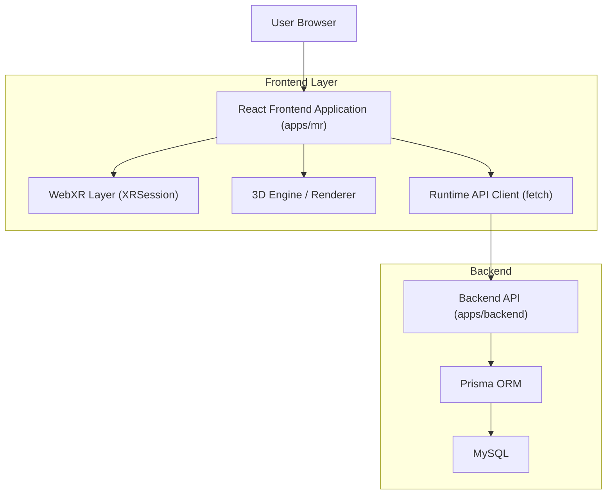

## 1.Architecture design

## 2.Technology Description
- Frontend: Next.js (apps/mr) + React + TypeScript + tailwindcss
- 3D/XR: WebXR Device API + three + @react-three/fiber + @react-three/xr
- Backend: Node.js + Express + TypeScript + Prisma
- Database: MySQL

## 3.Route definitions
| Route | Purpose |
|-------|---------|
| / | Landing page: selection cards Sepeda Motor/Mobil Listrik dan tombol lanjut |
| / | Scene menu 3D ditampilkan setelah pilih modul (state internal) |

## 4.API definitions (runtime)
- GET /api/runtime/modules
- GET /api/runtime/modules/:moduleId/manifest
- GET /api/runtime/scenes/:sceneId/manifest

## 6.Data model(if applicable)
Sumber data untuk module/scene berasal dari database via backend runtime API.
