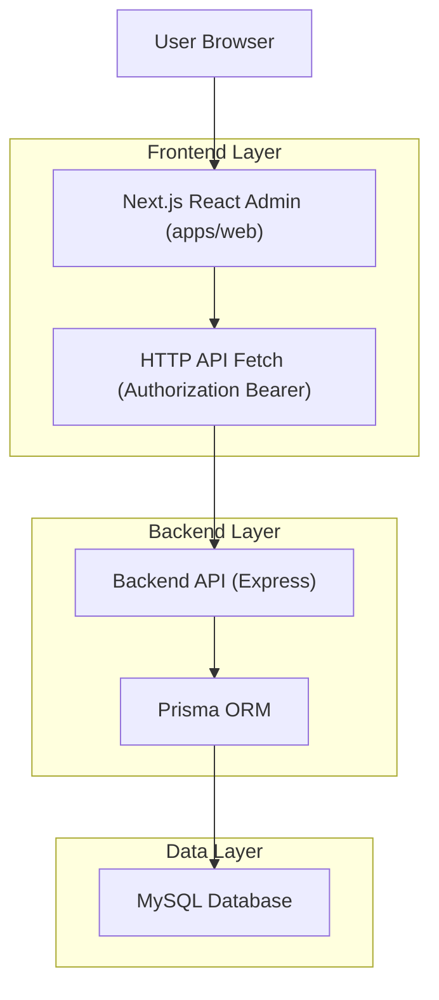
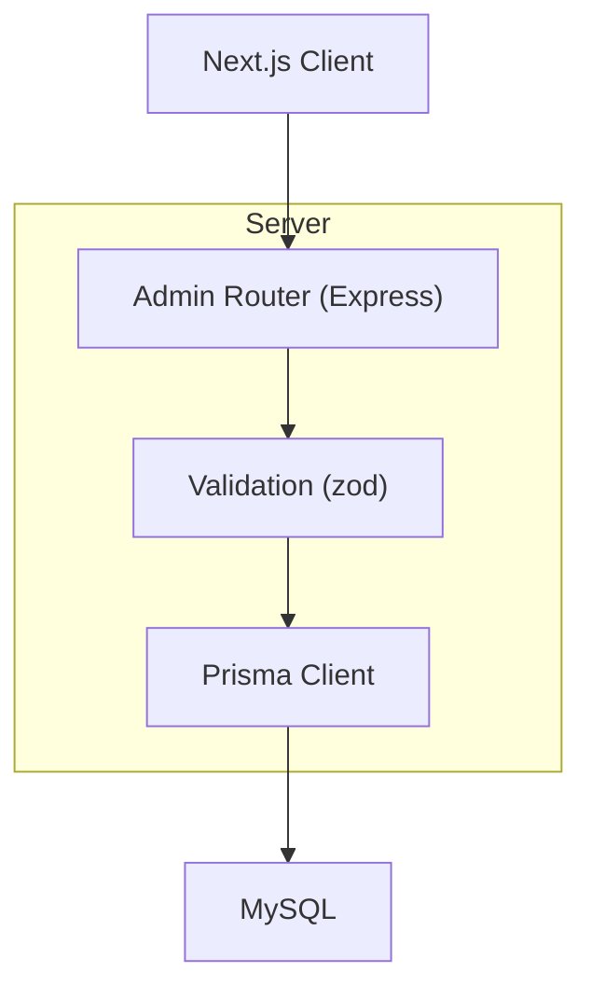
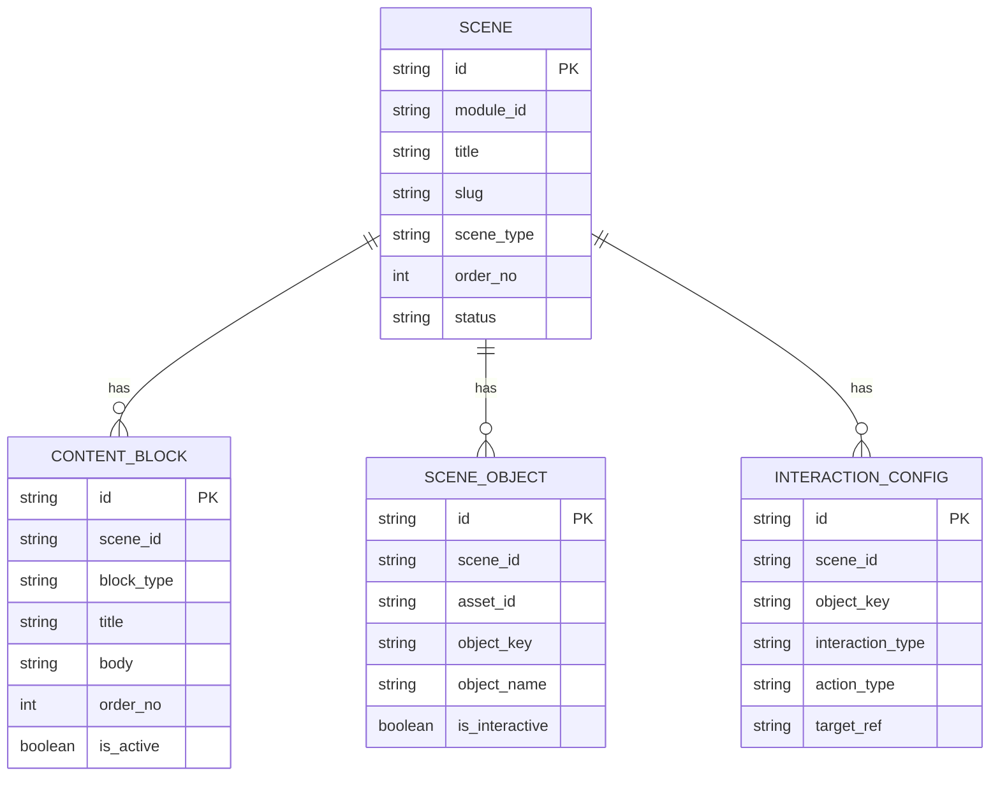

## 1.Architecture design


## 2.Technology Description
- Frontend: Next.js (React) + TypeScript + tailwindcss
- Backend: Node.js + Express + TypeScript + Prisma
- Database: MySQL

## 3.Route definitions
| Route | Purpose |
|-------|---------|
| /login | Autentikasi admin dan penyimpanan token akses |
| /scenes | Daftar scene (admin) |
| /scenes/:id | Detail scene (admin) termasuk manajemen blocks/objects/interactions/steps/evaluation |

## 4.API definitions (If it includes backend services)
### 4.1 Core API (Scene Detail)
Scene
- GET /api/admin/scenes/:id
- PATCH /api/admin/scenes/:id

Scene Objects
- GET /api/admin/scenes/:sceneId/objects
- POST /api/admin/scenes/:sceneId/objects
- PATCH /api/admin/scene-objects/:id
- DELETE /api/admin/scene-objects/:id

Content Blocks
- GET /api/admin/scenes/:sceneId/content-blocks
- POST /api/admin/scenes/:sceneId/content-blocks
- PATCH /api/admin/content-blocks/:id
- DELETE /api/admin/content-blocks/:id

Interactions
- GET /api/admin/scenes/:sceneId/interactions
- POST /api/admin/scenes/:sceneId/interactions
- PATCH /api/admin/interactions/:id
- DELETE /api/admin/interactions/:id

Practice Steps
- GET /api/admin/scenes/:sceneId/practice-steps
- POST /api/admin/scenes/:sceneId/practice-steps
- PATCH /api/admin/practice-steps/:id
- DELETE /api/admin/practice-steps/:id

Evaluation
- GET /api/admin/scenes/:sceneId/evaluations
- POST /api/admin/scenes/:sceneId/evaluations
- PATCH /api/admin/evaluations/:id
- DELETE /api/admin/evaluations/:id

Shared types (TypeScript)
```ts
export type ContentBlockType = "card" | "instruction" | "hotspot" | "label"

export type ContentBlockRow = {
  id: string
  sceneId: string
  blockType: ContentBlockType
  title: string | null
  body: string | null
  mediaUrl: string | null
  triggerType: string | null
  targetObjectKey: string | null
  orderNo: number
  isActive: boolean
}
```

## 5.Server architecture diagram (If it includes backend services)


## 6.Data model(if applicable)
### 6.1 Data model definition


### 6.2 Data Definition Language
Content blocks (content_blocks)
```sql
CREATE TABLE content_blocks (
  id VARCHAR(191) PRIMARY KEY,
  scene_id VARCHAR(191) NOT NULL,
  block_type VARCHAR(191) NOT NULL,
  title VARCHAR(191) NULL,
  body TEXT NULL,
  media_url VARCHAR(191) NULL,
  trigger_type VARCHAR(191) NULL,
  target_object_key VARCHAR(191) NULL,
  order_no INT NOT NULL DEFAULT 0,
  is_active TINYINT(1) NOT NULL DEFAULT 1
);
CREATE INDEX idx_content_blocks_scene_order ON content_blocks(scene_id, order_no);
```
